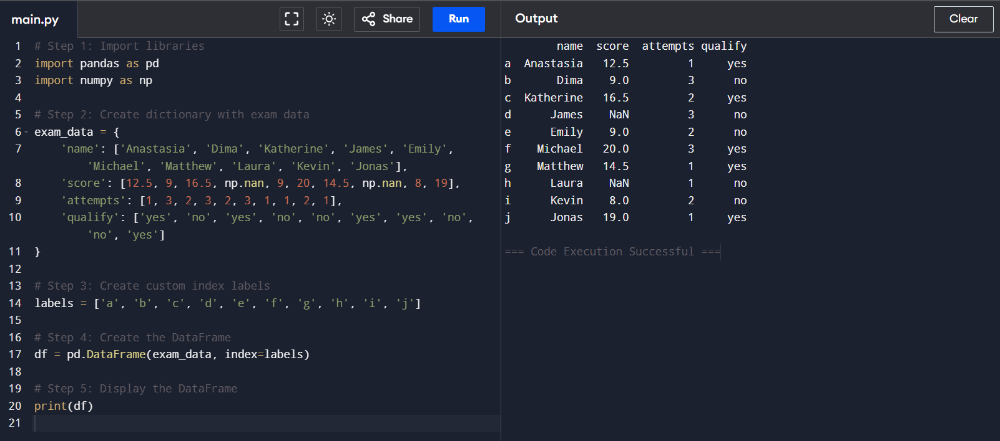

# NumPy Program: Column-wise Sorting of a 2D Array

## 🎯 Aim
To write a **NumPy** program that sorts the elements in each column of a given 2D array in ascending order.

## 🧠 Algorithm

1. **Import NumPy**: Start by importing the NumPy library.
2. **Get Input**: Accept a 2D NumPy array from the user.
3. **Sort Column-wise**: Use the `np.sort()` function with `axis=0` to sort each column in ascending order.
4. **Store Result**: Store the sorted result in a new array.
5. **Display Output**: Print the original array and the column-wise sorted array.

## 🧾 Program
~~~
# Step 1: Import NumPy
import numpy as np

# Step 2: Get input for a 2D array
# For simplicity, we'll use input() to take rows separated by commas, numbers separated by spaces
rows = int(input("Enter the number of rows: "))
cols = int(input("Enter the number of columns: "))

array_input = []
for i in range(rows):
    row = list(map(int, input(f"Enter row {i+1} elements separated by space: ").split()))
    if len(row) != cols:
        print("Incorrect number of elements. Please try again.")
        exit()
    array_input.append(row)

# Convert to a NumPy array
arr = np.array(array_input)

# Step 3: Sort column-wise
sorted_arr = np.sort(arr, axis=0)

# Step 4 & 5: Display output
print("\nOriginal Array:\n", arr)
print("\nColumn-wise Sorted Array:\n", sorted_arr)
~~~

## Output

## Result
The given program is successfully executed

# # NumPy Program: Find Indices Where Elements in Array x are Greater Than or Equal to Corresponding Elements in Array y

## 🎯 Aim
To write a Python program using **NumPy** that finds the indices where elements in array `x` are greater than or equal to their corresponding elements in array `y`.

## 🧠 Algorithm
1. **Import NumPy**: Import the NumPy library.
2. **Define Arrays**: Define two NumPy arrays, `x` and `y`, with the same shape (i.e., same number of elements).
3. **Use Boolean Indexing**: 
   - `x > y` gives a boolean array where elements of `x` are greater than `y`.
   - `x == y` gives a boolean array where elements of `x` are equal to `y`.
4. **Find Indices**: Use `np.where()` to get the indices where the conditions `x >= y` are satisfied.
5. **Print Indices**: Print the indices where the condition holds true.

## 🧾 Program

# Step 1: Import NumPy
import numpy as np

# Step 2: Define two NumPy arrays of the same shape
x = np.array([5, 10, 15, 20])
y = np.array([3, 10, 8, 25])

# Step 3: Use boolean indexing
greater_than = x > y
equal_to = x == y

print("Boolean array x > y:", greater_than)
print("Boolean array x == y:", equal_to)

# Step 4: Find indices where x >= y
indices = np.where(x >= y)

# Step 5: Print the indices
print("Indices where x >= y:", indices[0])

## Output

## Result
The given program is successfully executed

# NumPy Program: Replace the Second Column in a 2D Array

## 🎯 Aim
To write a **NumPy** program that deletes the second column from a given 2D array and inserts a new column at the same position.

## 🧠 Algorithm
1. **Import NumPy**: Start by importing the NumPy library.
2. **Get Input**: Get a 2D NumPy array and a new column (as another array) from the user.
3. **Delete Column**: Use `np.delete()` to remove the second column (index 1) from the original array.
4. **Insert Column**: Use `np.insert()` to insert the new column at the second column's original position.
5. **Display Result**: Print the updated array with the replaced column.

## 🧾 Program
~~~
import numpy as np
rows = int(input("Enter the number of rows: "))
cols = int(input("Enter the number of columns: "))
array_input = []
for i in range(rows):
    row = list(map(int, input(f"Enter row {i+1} elements separated by space: ").split()))
    if len(row) != cols:
        print("Incorrect number of elements. Exiting.")
        exit()
    array_input.append(row)
arr = np.array(array_input)
new_col = list(map(int, input(f"Enter {rows} elements for the new column: ").split()))
if len(new_col) != rows:
    print("Incorrect number of elements for new column. Exiting.")
    exit()
new_col = np.array(new_col).reshape(rows, 1)
arr_modified = np.delete(arr, 1, axis=1)
arr_final = np.insert(arr_modified, 1, new_col, axis=1)
print("\nUpdated array with replaced column:\n", arr_final)
~~~

## Output

## Result
The given program is successfully executed

# Pandas Program: Create and Display a DataFrame with Custom Index Labels

## 🎯 Aim

To create and display a **DataFrame** using the **Pandas** library in Python from a given dictionary, and apply specific index labels to the rows.

---

## 🧠 Algorithm

1. **Import Libraries**: Import the required libraries – `pandas` and `numpy`.
2. **Create Dictionary**: Define a dictionary `exam_data` with keys: `'name'`, `'score'`, `'attempts'`, and `'qualify'`.
3. **Index Labels**: Create a list of custom index labels called `labels`.
4. **Create DataFrame**: Use `pd.DataFrame()` to create the DataFrame by passing the dictionary and index labels.
5. **Display Output**: Display the DataFrame using `print()` or by simply calling the DataFrame variable.

---

## 💻 Program
~~~
# Step 1: Import libraries
import pandas as pd
import numpy as np

# Step 2: Create dictionary with exam data
exam_data = {
    'name': ['Anastasia', 'Dima', 'Katherine', 'James', 'Emily', 'Michael', 'Matthew', 'Laura', 'Kevin', 'Jonas'],
    'score': [12.5, 9, 16.5, np.nan, 9, 20, 14.5, np.nan, 8, 19],
    'attempts': [1, 3, 2, 3, 2, 3, 1, 1, 2, 1],
    'qualify': ['yes', 'no', 'yes', 'no', 'no', 'yes', 'yes', 'no', 'no', 'yes']
}

# Step 3: Create custom index labels
labels = ['a', 'b', 'c', 'd', 'e', 'f', 'g', 'h', 'i', 'j']

# Step 4: Create the DataFrame
df = pd.DataFrame(exam_data, index=labels)

# Step 5: Display the DataFrame
print(df)

~~~

## Output

## Result
The given program is successfully executed

# 🧪 Pandas Program: Join Two DataFrames Along Rows

## 🎯 AIM

To write a Python program using Pandas to **join two DataFrames along rows** (row-wise concatenation) and assign all data to a new DataFrame.

---

## 🧠 ALGORITHM

1. **Import Libraries**: Import the `pandas` library.
2. **Create First DataFrame**: Use a dictionary to create `student_data1`.
3. **Create Second DataFrame**: Use another dictionary to create `student_data2`.
4. **Concatenate DataFrames**: Use `pd.concat()` with `axis=0` to concatenate both DataFrames row-wise.
5. **Display Result**: Print the new combined DataFrame.

---

## 💻 Program
~~~
# Step 1: Import pandas
import pandas as pd

# Step 2: Create the first DataFrame
student_data1 = {
    'Name': ['Alice', 'Bob', 'Charlie'],
    'Age': [20, 21, 19],
    'Grade': ['A', 'B', 'C']
}
df1 = pd.DataFrame(student_data1)

# Step 3: Create the second DataFrame
student_data2 = {
    'Name': ['David', 'Eva', 'Frank'],
    'Age': [22, 20, 21],
    'Grade': ['B', 'A', 'C']
}
df2 = pd.DataFrame(student_data2)

# Step 4: Concatenate DataFrames row-wise
combined_df = pd.concat([df1, df2], axis=0, ignore_index=True)

# Step 5: Display the combined DataFrame
print(combined_df)

~~~

## Output

## Result
The given program is successfully executed